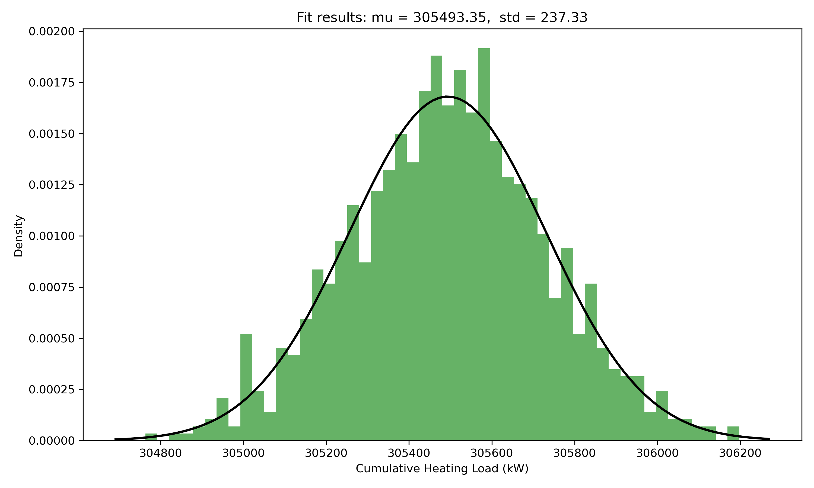

## Overview for determining ASHP maintenance uncertain parameter
This  branch focuses on developing probabilistic models to estimate heating loads, beta parameter variables, and electricity prices. It leverages uncertainty analysis and simulation techniques. Detailed implementation can be found in `uncertainty_VOI.py`.

### 1. Heating Load Calculation
To compute the heating load with uncertainty, a standard formula is used:
`Q = m * c_p * ΔT`
where:
- `m` is the water flow rate (kg/s or L/s),
- `c_p` is the specific heat capacity of water (kJ/kg·K), typically 4.18 kJ/kg·K,
- `ΔT` is the temperature difference between supply and return water (K or °C), assumed to be 10°C.

In this study, since only one year's heating load data are available, we assume uncertainties in the temperature difference between supply and return water as well as in the flow rate to generate a distribution of the heating load.
The formula is then rearranged to calculate the flow rate:

`m = Q / (c_p * ΔT)`

Given `Q`, `c_p` (4.18 kJ/kg·K for water), and `ΔT` (10°C), we can compute the flow rate `m`. Following this, we estimate the uncertainty in heating load by considering uncertainties in both flow rate and temperature.

We assumed Sensors Errors following the [European standard EN1434](https://www.kamstrup.com/en-en/insights/blog-series-part-2-a-thermal-energy-meter-you-can-trust).
- Temperature Sensor Error: 0.5°C
- Flow Meter Error: 2% 

Using Monte Carlo simulation (1000 iterations), the annual total heating load distribution was determined.

**Figure 1: Cumulative Heating Load**

### 2. Beta Parameter
The relationship between the annual number of maintenance activities (`N_m`) and the beta parameter (`β`) is given by:
`β = (β_a * N_m^γ) / (β_b + N_m^γ)`
where `β_a = 0.05`, `β_b = 2.5`, `γ = 1.4`, and `N_m` is the annual number of maintenance activities.

We assume that the uncertainty in beta increases with more maintenance activities. This is represented by adding a range of uncertainty proportional to (`N_m`). 

Beta Uncertainty is determined using the following formula:
`Beta Uncertainty = 0.002 * N_m` (0.2% per maintenance activity)

**Figure 2: Performance Improvement Distribution**

### 3. Electricity Prices
Electricity price data was downloaded from [Gov.uk](https://www.gov.uk/government/statistical-data-sets/annual-domestic-energy-price-statistics), using the 2022 average annual electricity prices for different payment methods across the UK to fit the distribution of electricity prices.

**Figure 3: 2022 Electricity Prices**

Note: The electricity price data can be flexibly considered for VOI calculations, such as using data from the past five years (2018-2022) to fit the distribution.
